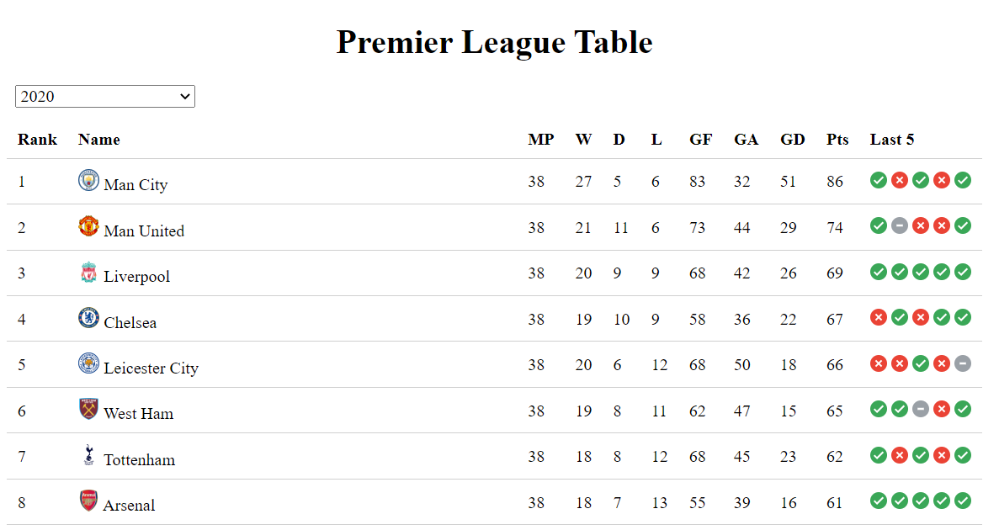

# Football Standings

Discover the football league tables of the top 4 leagues in the world. 

## How It's Made:

**Tech used:** HTML, CSS, JavaScript

Used the [football-data.org](https://www.football-data.org/) API to fetch the data for Brazil Serie A, English Premier League, Serie A, & LaLiga.

## Usage:

1) Update "justcors" variable's temporary link
2) Launch index.html

## Optimizations

For the time being, there is a Cross-Origin Resource Sharing (CORS) error that is being temporarily solved by reassigning the "justcors" variable (in main.js & prem.js) using [justcors.com](https://justcors.com/) 

## Lessons Learned:

Learned about Nodelists and how they are different from Arrays, i.e. if we want to display a string of text, we must use the innerText property as opposed to direct assignment.

Learned how to write DRY and Modular code - used functions to separate functionality (especially in prem.js) so that code is easily readable.
